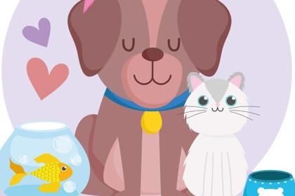

# Ejemplo de POO en Java: Adopción de Animalitos  

En esta sección encontrarás un ejercicio temático para practicar los principios de **Programación Orientada a Objetos (POO)** en Java.  

## 1) Página de Adopción de Animalitos (`Main.java`)  

  

El objetivo es simular una página web de adopción de animalitos, aplicando **abstracción, herencia, polimorfismo y encapsulamiento**.  

### Desarrolla un programa que permita:

1. **Clase Animal**  
   - Crear la clase `Animal` con los atributos: `nombre`, `edad` y `peso`.  
   - Este paso representa la **abstracción**, ya que defines un modelo general de lo que es un animal.  

2. **Constructor**  
   - Implementar un constructor que permita inicializar los atributos al crear un nuevo objeto.  
   - Esto asegura que cada animal tenga valores definidos desde el inicio.  

3. **Instancia genérica**  
   - Crear un objeto llamado `animal_generico` con los siguientes valores:  
     - Nombre: `"Animal Genérico"`  
     - Edad: `4 años`  
     - Peso: `5 kg`  
   - Este objeto servirá como ejemplo de cómo instanciar una clase.  

4. **Funciones info() y ruido()**  
   - `info()`: debe mostrar en consola la información del animal (nombre, edad y peso).  
   - `ruido()`: debe imprimir un mensaje con un ruido genérico, representando el comportamiento común de todos los animales.  

5. **Herencia**  
   - Crear dos clases hijas que extiendan de `Animal`:  
     - `Gato`: debe tener un atributo adicional `colorPelaje`.  
     - `Pez`: debe tener un atributo `aguaFria` (booleano) que indique si es un pez de agua fría.  
   - Este paso aplica el concepto de **herencia**, permitiendo que las clases hijas reutilicen y amplíen la funcionalidad de la clase padre.  

6. **Polimorfismo**  
   - Sobrescribir los métodos `info()` y `ruido()` en las clases `Gato` y `Pez`.  
   - Ejemplo:  
     - En `Gato`, `ruido()` puede imprimir `"Miau"` y `info()` mostrar también el color del pelaje.  
     - En `Pez`, `ruido()` puede imprimir `"Blub"` y `info()` mostrar si es de agua fría o no.  
   - Esto demuestra el **polimorfismo**, donde las clases hijas redefinen el comportamiento heredado.  

7. **Encapsulamiento**  
   - Definir algunos atributos como `private` para protegerlos.  
   - Crear métodos `get` y `set` que permitan acceder y modificar esos atributos de forma controlada.  
   - Esto asegura que los datos internos del objeto estén protegidos y solo puedan ser manipulados de manera segura.  

---
