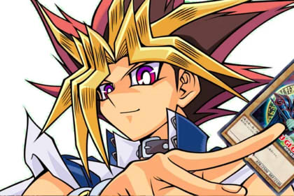

# ⚡ ¡Es la hora... del Duelo! ⚡



Una tienda especializada en juegos de cartas necesita un sistema sencillo para administrar su stock de cartas de duelo.

Existen distintos tipos de cartas, pero todas comparten una característica en común: poseen un nombre.

Tu misión será modelar las cartas utilizando herencia y demostrar el uso de polimorfismo al almacenarlas en una misma colección.

---

# Clase Base

Debes crear una clase llamada:

```java
Carta
```

### Atributos

- nombre

### Métodos

#### Constructor

Debe permitir inicializar todos los atributos.

#### toString()

Debe retornar un texto similar a:

```text
Carta: Dragón Blanco de Ojos Azules
```

---

# Cartas de Monstruo

Debes crear una clase llamada:

```java
CartaMonstruo
```

que herede de `Carta`.

### Atributos adicionales

- ataque
- defensa

### Polimorfismo

Debe sobrescribir el método `toString()` para mostrar toda la información del monstruo.

Ejemplo:

```text
Carta Monstruo: Dragón Blanco de Ojos Azules | ATK: 3000 | DEF: 2500
```

---

# Cartas de Trampa

Debes crear una clase llamada:

```java
CartaTrampa
```

que herede de `Carta`.

### Atributo adicional

- efecto

### Polimorfismo

Debe sobrescribir el método `toString()` para mostrar toda la información de la carta.

Ejemplo:

```text
Carta Trampa: Fuerza de Espejo | Efecto: Destruye todos los monstruos en posición de ataque.
```

---

# Clase Principal

En la clase `Main` debes realizar las siguientes acciones:

## 1. Instanciar varias cartas

Como mínimo:

- 2 cartas de monstruo
- 2 cartas de trampa

Ejemplo:

```java
Dragón Blanco de Ojos Azules
Mago Oscuro
Fuerza de Espejo
Cilindro Mágico
```

---

## 2. Crear una lista vacía

Crear una colección capaz de almacenar cartas:

```java
ArrayList<Carta>
```

---

## 3. Agregar las cartas a la lista

Incorporar todas las cartas creadas anteriormente a la colección.

---

## 4. Recorrer la lista

Utilizar un ciclo para recorrer todas las cartas almacenadas.

Por cada carta encontrada se debe imprimir su información utilizando:

```java
toString()
```

---

# ¿Qué debe ocurrir?

Aunque la lista almacene objetos del tipo:

```java
Carta
```

cada objeto deberá ejecutar automáticamente la versión correcta de `toString()` según su tipo real:

- CartaMonstruo
- CartaTrampa

Este comportamiento corresponde al concepto de:

## Polimorfismo

---

# Ejemplo de salida esperada

```text
=== STOCK DE CARTAS ===

Carta Monstruo: Dragón Blanco de Ojos Azules | ATK: 3000 | DEF: 2500

Carta Monstruo: Mago Oscuro | ATK: 2500 | DEF: 2100

Carta Trampa: Fuerza de Espejo | Efecto: Destruye todos los monstruos en posición de ataque.

Carta Trampa: Cilindro Mágico | Efecto: Niega un ataque e inflige daño al oponente.
```