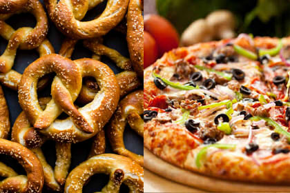

# 🥨 Tiendas de Comida 🍕



## Objetivo

Aplicar los conceptos de:

- Interfaces
- Implementación de métodos
- Clases y objetos
- Encapsulamiento
- Polimorfismo básico

---

## Contexto

¡Es hora de comer!

Una aplicación necesita administrar distintas tiendas de comida. Todas las tiendas comparten cierta información básica, pero cada tipo de negocio puede tener una forma diferente de interactuar con sus clientes.

Debes modelar el sistema utilizando **interfaces** e **implementación de clases**.

---

## Requerimientos

Todas las tiendas de comida poseen los siguientes atributos:

- Nombre
- Dirección
- Teléfono

Existen dos tipos de tiendas:

- Pizzería
- Pretzelería

---

## Interfaz

Crea una interfaz llamada `TiendaComida` que contenga las siguientes funciones:

```java
String datosTienda();

String llamarTienda();

String saludoPersonalizado();
```

### Descripción de las funciones

#### datosTienda()

Debe retornar un texto con los datos principales de la tienda.

Ejemplo:

```text
Pizzería Don Luigi - Av. Central 123 - Tel: 987654321
```

---

#### llamarTienda()

Debe retornar un mensaje simulando una llamada telefónica.

Ejemplo:

```text
Llamando a Pizzería Don Luigi al número 987654321...
```

---

#### saludoPersonalizado()

Debe retornar un saludo propio del tipo de tienda.

Ejemplos:

```text
¡Bienvenido a Pizzería Don Luigi! Tenemos las mejores pizzas de la ciudad.
```

```text
¡Bienvenido a Pretzelería Munich! Disfruta nuestros pretzels recién horneados.
```

---

## Clases

Debes crear las siguientes clases:

### Pizzeria

Implementa la interfaz `TiendaComida`.

Atributos:

- nombre
- direccion
- telefono

---

### Pretzeleria

Implementa la interfaz `TiendaComida`.

Atributos:

- nombre
- direccion
- telefono

---

## Clase Principal

En la clase `Main` debes:

1. Instanciar 2 objetos de tipo `Pizzeria`.
2. Instanciar 1 objeto de tipo `Pretzeleria`.
3. Invocar al menos una vez cada uno de los métodos definidos en la interfaz.
4. Mostrar los resultados por consola.

---

## Salida esperada (ejemplo)

```text
Pizzería Don Luigi - Av. Central 123 - Tel: 987654321

Llamando a Pizzería Don Luigi al número 987654321...

¡Bienvenido a Pizzería Don Luigi! Tenemos las mejores pizzas de la ciudad.

Pretzelería Munich - Calle Alemania 456 - Tel: 912345678

Llamando a Pretzelería Munich al número 912345678...

¡Bienvenido a Pretzelería Munich! Disfruta nuestros pretzels recién horneados.
```
