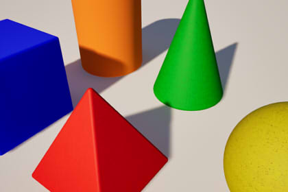

# Taller OOP: Figuras Geométricas

 

## Descripción

Desarrollar una solución orientada a objetos para modelar diferentes figuras geométricas utilizando los principios de **encapsulamiento**, **herencia**, **interfaces** y **polimorfismo**.

## Requerimientos

### Clase Base: `Figura`

Todas las figuras geométricas deben heredar de una clase abstracta llamada `Figura`.

#### Atributos

La clase debe contener los siguientes atributos:

- `creador : String`
- `fechaCreacion : String`

Estos atributos deben ser **privados (`private`)**, por lo que no pueden ser accedidos directamente desde fuera de la clase.

#### Métodos

- Constructor para inicializar todos los atributos.
- Método `toString()` que muestre la información de la figura.

---

### Interfaz: `Calculos`

Crear una interfaz llamada `Calculos` que declare los siguientes métodos:

```java
int calcularArea();
int calcularPerimetro();
```

Todas las figuras deberán implementar esta interfaz.

---

## Figuras Geométricas

### Cuadrado

Hereda de `Figura` e implementa `Calculos`.

#### Atributos

- `base : int`

#### Fórmulas

- Área = base × base
- Perímetro = 4 × base

---

### Rectángulo

Hereda de `Figura` e implementa `Calculos`.

#### Atributos

- `base : int`
- `altura : int`

#### Fórmulas

- Área = base × altura
- Perímetro = 2 × (base + altura)

---

### Triángulo

Hereda de `Figura` e implementa `Calculos`.

#### Atributos

- `base : int`
- `altura : int`

#### Fórmulas

- Área = (base × altura) / 2

Para efectos del ejercicio, el perímetro puede calcularse suponiendo un triángulo equilátero:

- Perímetro = 3 × base

---

### Círculo

Hereda de `Figura` e implementa `Calculos`.

#### Atributos

- `radio : int`

#### Fórmulas

- Área = π × radio²
- Perímetro = 2 × π × radio

> Puede utilizarse `Math.PI` para los cálculos. El resultado puede convertirse a `int`.

---

## Polimorfismo

Cada figura debe sobrescribir (`override`) el método `toString()` para mostrar:

- Tipo de figura
- Creador
- Fecha de creación
- Área
- Perímetro
- Atributos específicos de la figura

Ejemplo:

```text
Figura: Cuadrado
Creador: Álvaro
Fecha: 2026-09-28
Base: 5
Área: 25
Perímetro: 20
```

---

## Pruebas en Main

En la clase `Main` deberá:

1. Crear instancias de todas las figuras.
2. Guardarlas en una colección de tipo `Figura`.
3. Recorrer la colección utilizando polimorfismo.
4. Mostrar la información de cada objeto mediante `toString()`.

### Ejemplo

```java
List<Figura> figuras = new ArrayList<>();

figuras.add(new Cuadrado("Álvaro", "2026-09-28", 5));
figuras.add(new Rectangulo("Álvaro", "2026-09-28", 8, 4));
figuras.add(new Triangulo("Álvaro", "2026-09-28", 6, 3));
figuras.add(new Circulo("Álvaro", "2026-09-28", 7));

for (Figura figura : figuras) {
    System.out.println(figura);
}
```

---

## Conceptos Evaluados

- Encapsulamiento (`private`)
- Herencia
- Interfaces
- Polimorfismo
- Sobrescritura de métodos (`@Override`)
- Uso de clases abstractas
- Colecciones (`List`)
- Programación Orientada a Objetos (OOP)

---

## Estructura Esperada

```text
src/
│
├── Calculos.java
├── Figura.java
├── Cuadrado.java
├── Rectangulo.java
├── Triangulo.java
├── Circulo.java
└── Main.java
```

## Resultado Esperado

La aplicación debe permitir representar diferentes figuras geométricas utilizando una jerarquía de clases orientada a objetos, calculando correctamente área y perímetro, protegiendo la información interna mediante encapsulación y demostrando polimorfismo al imprimir los objetos desde una referencia de tipo `Figura`.