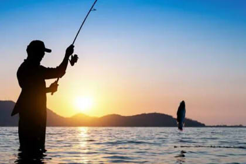

# 🎣 Simulador de Pesca en Java

  

Este proyecto permite simular la captura de peces por parte de un pescador. El objetivo es aplicar los **principios de la Programación Orientada a Objetos (POO)**:  
- Abstracción 
- Encapsulamiento
- Herencia
- Polimorfismo

Además, se utilizan **colecciones** (`List`) para almacenar los peces capturados.

---

## 📌 Requisitos del Problema

- Crear una **clase Pez** con atributos comunes (`nombre`, `peso`, `longitud`) y métodos (`info()`, `sonido()`).
- Implementar **herencia** con clases hijas:
  - `Atun` con atributo `velocidadNado`.
  - `Salmon` con atributo `origenRio`.
  - `Robalo` con atributo `profundidadHabitat`.
- Aplicar **encapsulamiento**: atributos privados y métodos `get/set`.
- Crear la clase **Pescador** con atributos (`nombre`, `edad`, `nacionalidad`) y una lista de peces capturados.
- Métodos en `Pescador`:
  - `pescar(Pez pez)`: agrega un pez a la lista.
  - `mostrarPeces()`: recorre la lista e imprime información de cada pez.

---

## 🧑‍💻 Código Base

### Clase `Pez`
- Define atributos comunes.
- Método abstracto `sonido()`.
- Método `info()` para mostrar datos generales.

### Subclases
- **Atun**: redefine `info()` y `sonido()`, agrega `velocidadNado`.  
- **Salmon**: redefine `info()` y `sonido()`, agrega `origenRio`.  
- **Robalo**: redefine `info()` y `sonido()`, agrega `profundidadHabitat`.

### Clase `Pescador`
- Atributos: `nombre`, `edad`, `nacionalidad`.  
- Colección: `List<Pez> pecesPescados`.  
- Métodos:  
  - `pescar(Pez pez)` → agrega un pez.  
  - `mostrarPeces()` → imprime todos los peces capturados.

### Clase `SimuladorPesca`
Ejemplo de uso:
- Crear un pescador.  
- Pescar distintos peces (`Atun`, `Salmon`, `Robalo`).  
- Mostrar los peces capturados.

---

## 🚀 Ejemplo de Ejecución

**Salida esperada:**

Juan ha pescado un Atun  
Juan ha pescado un Salmon  
Juan ha pescado un Robalo  

Peces pescados por Juan:  
Nombre: Atún Azul, Peso: 50 kg, Longitud: 120 cm  
Velocidad de nado: 70 km/h  
El atún hace: splash!  

Nombre: Salmón del Pacífico, Peso: 8 kg, Longitud: 60 cm  
Origen del río: Río Baker  
El salmón hace: blub!  

Nombre: Róbalo Común, Peso: 5 kg, Longitud: 40 cm  
Habita a 30 metros de profundidad  
El róbalo hace: glup!  

---
