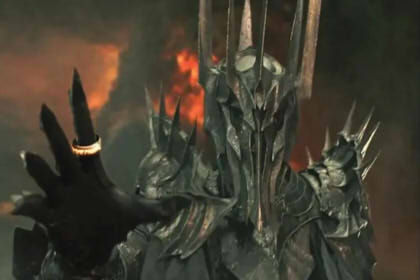

# ⚔️ Batalla contra el REY DEL MAL

## Descripción
Debes crear el enfrentamiento contra el malvado **REY DEL MAL**.  
Para ello se define una clase genérica `Personaje` y sus clases hijas: **Mago**, **Sanador**, **Arquero**, **Guerrero** y **Monstruo**, que heredan de `Personaje`.

Cada clase tiene habilidades únicas que representan su rol en la batalla:

### 🧙‍♂️ Mago
*El sabio del grupo, capaz de generar poderosos hechizos que dañan a los enemigos. Su conocimiento arcano le permite invocar relámpagos devastadores y ventiscas heladas que debilitan incluso al adversario más fuerte.*
- Tiene el atributo `magia`.  
- **Relámpago**: inflige `1.5 * magia` puntos de daño.  
- **Ventisca**: inflige `3 * magia` puntos de daño. 

  

### 🌸 Sanador
*El corazón del equipo, sus hechizos curan y reponen la energía del grupo para poder avanzar. Aurora es quien mantiene a los héroes en pie, eliminando estados alterados y fortaleciendo a sus compañeros con bendiciones.*
- Tiene el atributo `magia`.  
- **Sanar**: recupera puntos de vida iguales a su magia.  
- **Curar**: elimina estados alterados (ej. envenenado).  
- **Bendición**: aumenta el ataque de un aliado en +10.  

  

### 🏹 Arquero
*Rápida y sigilosa, ataca a distancia y puede lanzar más de una flecha con sus ataques. Diana aprovecha su rango para infligir daño preciso y constante, siendo la especialista en ataques veloces y certeros.*
- Tiene el atributo `rango` (`bajo`, `medio`, `alto`).  
- **Flecha Triple**:  
  - Rango bajo → `1 * ataque`  
  - Rango medio → `2 * ataque`  
  - Rango alto → `3 * ataque`  

  

### 🛡️ Guerrero
*El escudo del grupo, capaz de bloquear ataques del enemigo y defender a los demás. Rex combina fuerza y resistencia, y con su “Golpe de la Justicia” puede devolver el daño con una fuerza implacable.*
- **Bloqueo**: 40% de probabilidad de anular completamente un ataque del monstruo.  
- **Golpe de la Justicia**: inflige `2.2 * ataque` puntos de daño.  

  

### 👹 Monstruo (REY DEL MAL)
*Un villano poderoso que quiere conquistar el mundo. Sus ataques son brutales y sus hechizos venenosos debilitan a los héroes. El grupo de valientes es lo único que se interpone en su camino hacia la dominación total.*
- **Envenenar**: inflige daño igual a su ataque y cambia el estado del objetivo a *Envenenado*.  
- **Golpe Mortal**: inflige `5 * ataque`. Si la vida del objetivo queda bajo 50, se reduce a 0 y pasa a estado *Desmayado*.  

  

---

## 🚀 Simulación
Finalmente, se deben instanciar los 4 héroes que lucharán en nombre de la justicia:

- **Aurora** → Sanadora  
- **Diana** → Arquera  
- **Vincent** → Mago  
- **Rex** → Guerrero  

Ellos se enfrentarán al poderoso **REY DEL MAL**, que posee gran ataque y vida, pero no debe derrotarlos inmediatamente.  
Durante la simulación, cada héroe debe lanzar al menos **2 ataques**, mientras que el REY DEL MAL debe ejecutar al menos **4 ataques devastadores**.

---

## 🎯 Objetivo
El objetivo de este proyecto es practicar:
- Herencia en Java.  
- Polimorfismo y métodos específicos por clase.  
- Uso de atributos y estados para simular una batalla RPG.  
- Impresión con colores y mensajes en consola para dar más vida a la simulación.  

---

